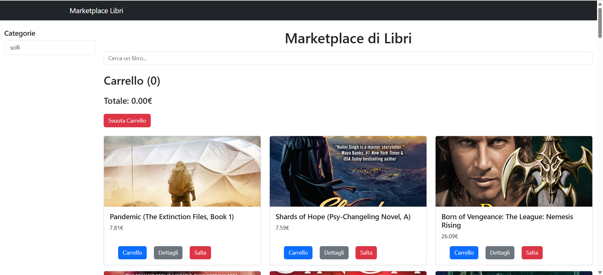

# 📕 Marketplace di Libri

Una mini‑webapp front‑end che mostra un marketplace di libri: pagina elenco con i libri e pagina dettaglio per il singolo prodotto. Progetto realizzato con HTML, CSS e JavaScript vanilla, focalizzato su struttura pulita, styling semplice e logica chiara.

Guarda il sito live qui: [https://market-place-libri-alina.netlify.app/](https://market-place-libri-alina.netlify.app/)

---
### 📚 Home Page   
 

## Tecnologie
 
 
 

---
## Cosa fa

- Homepage (Elenco): visualizza i libri in una griglia (card/lista), con layout responsive.
- Pagina Dettaglio: mostra le info di un singolo libro quando l’utente seleziona un elemento dall’elenco.
- UX semplice: struttura chiara, stili essenziali, pronta per essere estesa con ricerca/filtri/carrello.

Nella repo trovi la pagina principale `index.html` e la pagina di dettaglio `detagli.html` (nome file così com’è in repo). 
La logica è gestita da `scrypt.js` e `detagli.js`, mentre lo stile è in `style.css`. 

---

## Come eseguirla in locale
Clona la repo:
```
1. git clone https://github.com/Alina-Galben/M4S2D4-Marketplace-Libri.git
2. cd Marketplace-Libri
3. Apri `index.html` con un’estensione tipo Live Server (VS Code) oppure doppio‑click per aprirlo nel browser.
4. La stessa cosa per `detagil.html`
```

## Roadmap / Miglioramenti futuri
- 🔎 Ricerca e Filtri (titolo, autore, prezzo).
- 🧭 Paginazione o infinite scroll per dataset grandi.
- 🛒 Carrello e checkout fittizio per simulare un e‑commerce.
- 💡 Messaggi di stato (loading, error, empty state).
- 🖼️ Placeholder immagini e skeleton UI in caricamento.
- 🧰 Refactor: separare funzioni in più file JS, naming coerente (es. script.js al posto di scrypt.js, dettagli.html/js al posto di detagli…).
- 🔐 Gestione token più sicura (proxy backend) per evitare esporre credenziali.

---

## 📄 Licence: 
- Progetto open source, creato a scopo formativo.
- Sentiti libero di clonarlo, modificarlo o contribuire! 🌟

